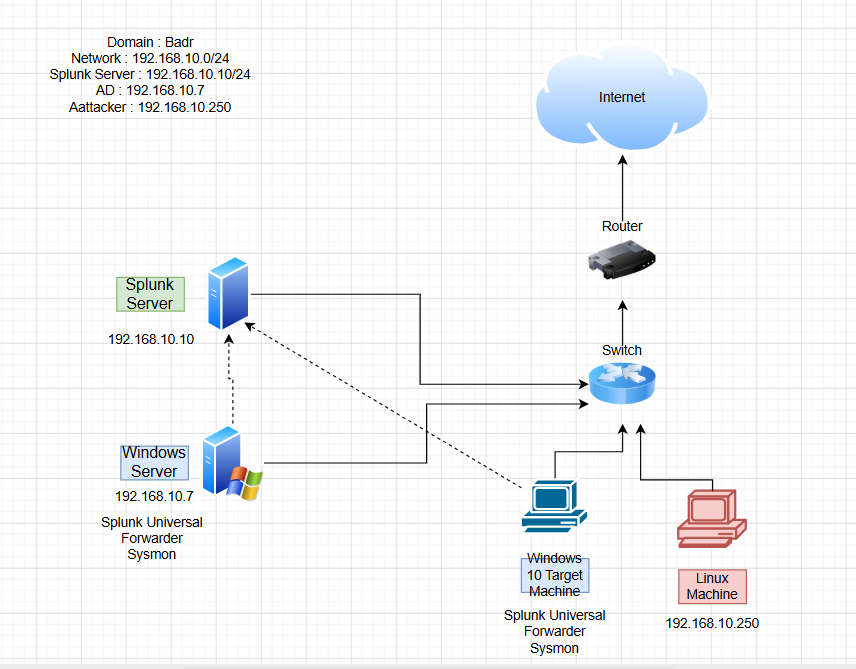

# Active Directory Defensive & Offensive Security Lab (SOC Telemetry)

## 📌 Project Overview
This project demonstrates the deployment, security hardening, attack simulation, and incident monitoring of an enterprise Active Directory (AD) environment. By routing endpoint and server telemetry into a centralized Splunk SIEM instance, this lab replicates real-world corporate SOC visibility against common modern threat vectors.

## 🛠️ Infrastructure Architecture
The entire environment is built using isolated hypervisor environments under a strictly non-routable host-only topology to avoid bleeding live exploitation traffic onto production networks.

* **Domain Name:** `badr.local`
* **Network Subnet:** `192.168.10.0/24`
* **Domain Controller (AD DS):** `192.168.10.7` — Windows Server 2022
* **SIEM Core Server:** `192.168.10.10` — Ubuntu Linux Server (Splunk Enterprise)
* **Target Workstation:** `192.168.10.100` — Windows 10/11 Enterprise Client
* **Attack Platform:** `192.168.10.250` — Kali Linux

### Network Diagram


## 💻 Virtual Environment Sizing (VirtualBox)

| Machine Name | Operating System | vCPU | RAM | Base Role |
| :--- | :--- | :--- | :--- | :--- |
| **ADDC01** | Windows Server 2022 (Evaluation) | 2 | 4 GB | Domain Controller & DNS Server |
| **Ubuntu-SIEM**| Ubuntu Server 24.04 LTS | 2 | 4 GB | Splunk Enterprise Core |
| **Win10-Target**| Windows 10 Enterprise | 1 | 2 GB | Domain Joined Client |
| **Kali-Attacker**| Kali Linux | 1 | 2 GB | Pentesting Platform |

> ⚠️ **Troubleshooting Note:** After the initial Windows Server setup, ensure to remove the installation ISO from the VirtualBox virtual optical drive to prevent the boot order from cycling back into the installer loop.

## 🌐 Network Configuration & Infrastructure Topology

To establish a predictable, non-routable, and isolated lab environment, all virtual assets are contained within a dedicated VirtualBox **NAT Network** named `AD-Project` mapped to the `192.168.10.0/24` subnet.

### 📋 Global IP Addressing Table
| Asset | Hostname | Role | Operating System | IP Address | Subnet Mask | Gateway | Primary DNS |
| :--- | :--- | :--- | :--- | :--- | :--- | :--- | :--- |
| **SIEM Server** | `splunk-siem` | Centralized Log Analytics | Ubuntu Server 24.04 | `192.168.10.10` | `255.255.255.0` | `192.168.10.1` | `8.8.8.8` |
| **Domain Controller** | `ADDC01` | Active Directory Domain Services | Windows Server 2022 | `192.168.10.7` | `255.255.255.0` | `192.168.10.1` | `127.0.0.1` |
| **Target Workstation** | `target-PC` | Endpoint Monitoring Target | Windows 10 Enterprise | `192.168.10.100` | `255.255.255.0` | `192.168.10.1` | `192.168.10.7` |
| **Attacker Machine**| `Kali-Attacker`| Adversary Simulation Platform | Kali Linux | `192.168.10.250`| `255.255.255.0` | `192.168.10.1` | `8.8.8.8` |

---

### 🐧 1. SIEM Server Configuration (`splunk-siem`)
The core log engine relies on a hardcoded interface setup via Netplan to eliminate network drift.

* **Configuration Blueprint (`/etc/netplan/50-cloud-init.yaml`)**:
```yaml
network:
  version: 2
  ethernets:
    enp0s3:
      dhcp4: no
      addresses:
        - 192.168.10.10/24
      nameservers:
        addresses: [8.8.8.8, 1.1.1.1]
      routes:
        - to: default
          via: 192.168.10.1
```


---

🪟 2. Active Directory Domain Controller (ADDC01)
Static parameters set at the Adapter properties (ncpa.cpl) level to maintain core Active Directory directory lookup pathways.

IP Assignment: 192.168.10.7

Subnet Mask: 255.255.255.0

Default Gateway: 192.168.10.1

Preferred DNS Server: 127.0.0.1


---

🪟 3. Target Endpoint Workstation (target-PC)
Configured to securely forward OS logs via the Universal Forwarder, with the active DNS pointed directly to the Domain Controller for authentication mapping.

IP Assignment: 192.168.10.100

Subnet Mask: 255.255.255.0

Default Gateway: 192.168.10.1

Preferred DNS Server: 192.168.10.7


---

🐉 4. Adversary Simulation Platform (Kali-Attacker)
Static addressing deployed on the interface to guarantee stable target scanning arrays during adversary emulation activities.

IP Assignment: 192.168.10.250

Subnet Mask: 255.255.255.0

Default Gateway: 192.168.10.1


---

🪵 Splunk Telemetry & Endpoint Host Verification

To ensure all centralized log paths are operational, host monitoring is verified through the Splunk Web interface. The ingestion pipeline tracks system logs forwarded dynamically across the isolated zone.


---

## 🌲 Active Directory Domain Provisioning & Directory Services

To replicate a production-grade enterprise hierarchy, Active Directory Domain Services (AD DS) were successfully provisioned on the Domain Controller (`ADDC01`), establishing the local administrative forest root authority.

### 🏢 Directory Architecture & Organizational Units (OUs)
The directory database is structured into operational units enforcing strict segregation of duties across logical business divisions:

* **Domain Authority:** `badr.local`
* **Domain Controller IP:** `192.168.10.7` (Preferred DNS for domain-joined endpoints to locate service location (SRV) records).

| Organizational Unit (OU) | Dedicated Identity Account | User Principal Name (UPN) | Active Directory Path |
| :--- | :--- | :--- | :--- |
| **IT Department** | `Badr Eddine Ait Ben Ijja` | `badr@badr.local` | `OU=IT,DC=badr,DC=local` |
| **HR Department** | `Mohamed Drider` | `medrider@badr.local` | `OU=HR,DC=badr,DC=local` |

---

### 🖥️ Step 1: Directory Services Hierarchical Blueprint
The Organizational Units and organizational objects were mapped using the **Active Directory Users and Computers (ADUC)** administrative console on `ADDC01`.


---

### 🖥️ Step 2: Client Domain Ingress Routing (Target Domain-Join)
To enroll the client endpoint into the centralized identity plane, the `target-PC` network stack configuration was dynamically re-routed to point exclusively to the Domain Controller DNS:

1. Leveraged local adapter configurations (`ncpa.cpl`) on `target-PC` to point **Preferred DNS** to `192.168.10.7`.
2. Initiated domain enrollment request querying `badr.local`.
3. Logged in and authorized credential binding using the `Mohamed Drider` (HR department) account.

#### 📸 [SCREENSHOT] - Active DNS Translation Config on Client
> 🟥 **[DROP HERE: Screenshot of `ipconfig /all` or IPv4 DNS settings on Windows 10 showing Preferred DNS bound to 192.168.10.7]**

#### 📸 [SCREENSHOT] - Domain Enrollment Host Verification
> 🟥 **[DROP HERE: Screenshot of Windows 10 System Properties showing computer name "target-PC" and Domain successfully bound to "badr.local"]**

#### 📸 [SCREENSHOT] - User Authentication Session Ingress
> 🟥 **[DROP HERE: Screenshot of Windows 10 active session displaying logged-in domain user "Mohamed Drider" (e.g., cmd command output of `whoami` or `echo %username%` displaying badr\mdrider)]**
